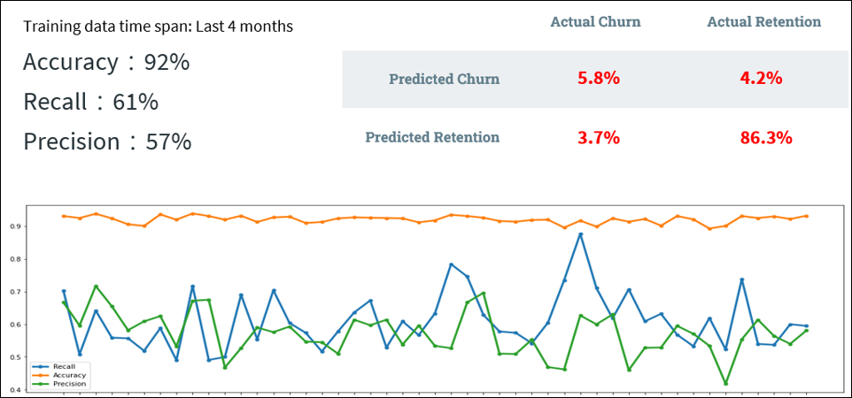
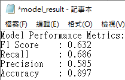
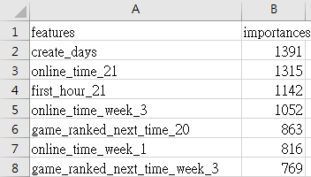
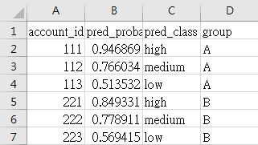

# Player-Churn-Prediction
玩家流失預測模型：分析玩家 21 天行為數據，預測下一週是否上線，並顯示各玩家的風險分類（高、中、低）。  
Churn prediction project analyzing 21 days of player behavior data to forecast next-week activity, with risk-based segmentation (high, medium, low).

### 專案簡介 | Project Overview
本專案透過分析玩家近 21 天的行為數據，預測下一週是否會上線（流失）。上線測試結果顯示，模型的平均 Precision 達 57%，平均 Accuracy 達 92%。
同時，根據玩家風險分層（高、中、低），設計差異化的挽回策略，如留存活動與優惠禮包。
此外，數據顯示低風險玩家領取活動後的 7 日留存率顯著提升 (+7.2%)，而高風險玩家可能因活動內容不符合預期而導致流失率上升 (-10.3%)。基於此現象，提出了改進活動內容與策略的具體建議。

This project analyzes 21 days of player behavior data to predict next week's activity (churn). 
After testing, the model achieved an average Precision of 57% and an average Accuracy of 92%. Based on risk segmentation (high, medium, low), tailored retention strategies, such as retention events and reward packages, were designed.
Additionally, it was found that the 7-day retention rate for low-risk players significantly improved (+7.2%) after receiving the event, while high-risk players experienced an increased churn rate (-10.3%) possibly due to dissatisfaction with the event content. Recommendations were made to improve the content and strategies of such activities.

---

### 主要目的 | Main Purpose
針對流失玩家實施量身定制的干預措施，如留存活動和優惠禮包。最終目標是通過識別高風險玩家並採取有效的策略，來提高玩家留存率。

Implement tailored interventions for churned players, such as retention events and reward packages.  
The ultimate goal is to identify high-risk players and apply effective strategies to improve player retention.

---

### 輸出結果 | Output Results
1. **model.pkl**  
   已訓練完成的模型，可透過 predict.py 進行預測（檔案未包含，因模型屬於敏感資料）。  
   The trained model file, used for predictions via predict.py. It can also be backed up on MLFlow (not included in GitHub due to sensitivity concerns).  
2. **model_result.txt**  
   包含模型最近 4 個月測試結果的數據摘要，包括 F1、Recall、Precision、Accuracy 指標。  
   Summary of the model's latest 4-month test results, including metrics such as F1, Recall, Precision, and Accuracy.  
     
3. **features.csv**  
   列出各特徵的重要性，能直觀呈現對模型影響較大的特徵。  
   Lists feature importance, providing a clear view of which features have the most significant impact on the model.  
   
4. **predict_result.csv**  
   預測前一天上線的用戶是否會流失，並提供流失風險評估（高、中、低風險）及分類，額外標記 AB 組以便後續活動效果追蹤與分析。  
   Predicts whether users active on the previous day will churn, with detailed risk assessments (high, medium, low) and segmentation.  
   Additional AB grouping is included for easier tracking and analysis of activity effectiveness.  
   

---

### 各檔案描述 | File Descriptions
- **data_processing.py**  
  玩家遊戲行為資料前處理，包時長、遊戲活躍指標、成長狀況及付費內容的每日及整合數據。  
  Handles preprocessing of player behavior data, including categorical conversion, data integration, and generating daily metrics.
  It also creates slope-based features to observe trends such as increased or decreased engagement over time.
  
- **insert_data.py**  
  更新最近已滿7天的玩家遊戲行為數據，並寫入 MySQL 資料庫，提升後續模型訓練與測試的效率。  
  Updates and inserts new player behavior data from the past 180 days into a MySQL database, improving the efficiency of future model training and testing.

- **modeling.py**  
  建立 LGBM 模型並調整超參數以構建最佳模型，最後上傳至 MLflow：
  1. 將數據集劃分為 train 與 test，並對 train 集進行 undersampling，以降低資料不平衡的影響。
  2. 使用 Optuna 進行交叉驗證（CV），執行 10 次超參數調整，找出前 30 個重要特徵建模。
  3. 針對篩選出的 30 個特徵，進行第二次建模，使用 Optuna 進行 50 次交叉驗證調整超參數。
  4. 依最佳超參數建模，將訓練結果、參數及模型匯出，並上傳至 MLflow，便於後續分析與版本管理。
  
  Build an LGBM model, optimize hyperparameters, and upload the best model to MLflow:
  1. Split the dataset into train and test sets, and perform undersampling on the train set to address class imbalance.
  2. Use Optuna for cross-validation (CV) to fine-tune hyperparameters with 10 iterations, focusing on the top 30 important features.
  3. Perform a second round of modeling with the 30 selected features, running Optuna for 50 CV iterations to refine hyperparameters
  4. Train the final model with the best hyperparameters, export the training results, parameters, and model, and upload them to MLflow for analysis and version control.

- **predit.py**  
  撈取最新 7 天的即時數據及已訓練好的模型（PKL 格式），對前一天有上線的玩家進行預測，並區分流失狀態、風險高低，以及是否發放活動的 AB 組別。  
  Fetch the latest 7-day real-time data and the trained model (in PKL format) to predict the activity of players who were online the previous day. Classify them by churn status, risk level, and AB group for activity allocation.
